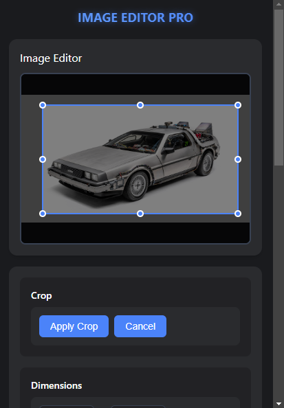
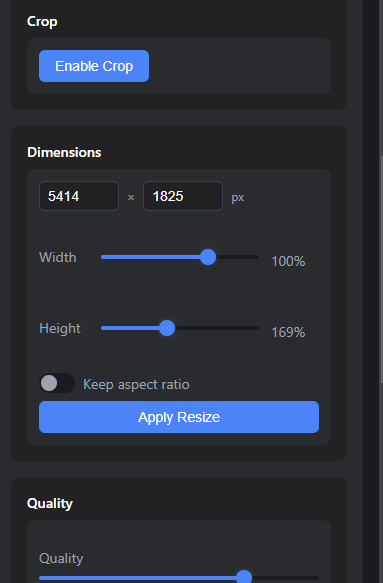
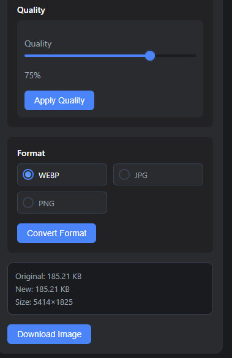

# Image Resizer Pro

A powerful Chrome extension that allows you to easily resize and manipulate images directly in your browser.

## Features

- Quick image resizing with customizable dimensions
- Preserve aspect ratio option
- Multiple preset size options
- Real-time preview
- Download resized images instantly
- User-friendly interface

## How It Works

Here's a visual guide to using Image Resizer Pro:

!### 1. Main Interface

*The main interface of Image Resizer Pro showing the image upload and resize options*

### 2. Image Processing

*Customize your image dimensions and settings*

### 3. Final Result

*Download your perfectly resized image*

## Installation

1. Download or clone this repository
2. Open Chrome and go to `chrome://extensions/`
3. Enable "Developer mode" in the top right corner
4. Click "Load unpacked" and select the extension directory
5. The extension icon will appear in your browser toolbar

## Usage

1. Click on the extension icon in your browser toolbar
2. Upload an image or paste an image URL
3. Choose your desired dimensions or select a preset size
4. Click "Resize" to process the image
5. Download your resized image

## Technologies Used

- HTML5
- CSS3
- JavaScript
- Chrome Extensions API

## Contributing

Contributions are welcome! Please feel free to submit a Pull Request.

## License

This project is licensed under the MIT License - see the LICENSE file for details.
